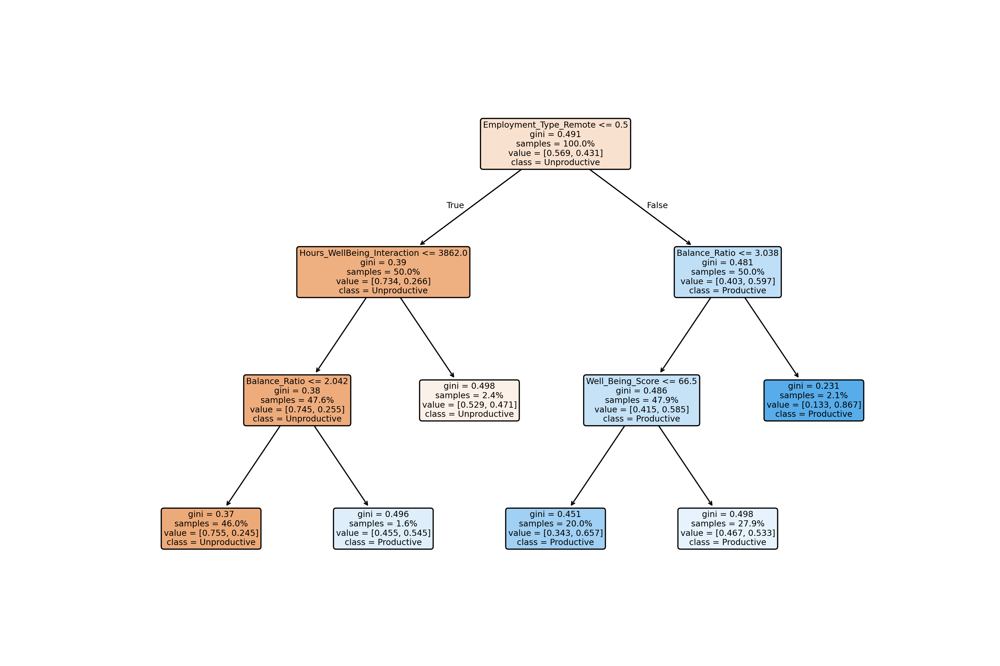

# Remote Work Productivity Prediction using Decision Tree

## Project Overview

This project predicts productive vs unproductive work-from-home days for employees using features such as:

- Hours Worked Per Week

- Well-Being Score

- Employment Type (Remote / In-Office)

- Engineered features: Balance Ratio, Hours × Well-Being Interaction

The model uses a Decision Tree Classifier with hyperparameter tuning and cross-validation to maximize predictive accuracy while keeping the model interpretable.

Features Used :
| Feature                     | Description                                 |
|-----------------------------|---------------------------------------------|
| Hours_Worked_Per_Week       | Number of hours worked in a week           |
| Well_Being_Score            | Employee’s well-being score                |
| Employment_Type_Remote      | 1 = Remote, 0 = In-Office                  |
| Balance_Ratio               | Well_Being_Score / Hours_Worked_Per_Week   |
| Hours_WellBeing_Interaction | Hours_Worked_Per_Week × Well_Being_Score   |


Note: Overwork_Flag was initially considered but found to have zero importance and removed.

## Setup Instructions

1. Clone the repository

```bash
git clone https://github.com/RahulAnand2077/remote-work-productivity.git
cd remote-work-productivity
```

2. Install dependencies

```bash
pip install -r requirements.txt
```

Dependencies include: pandas, scikit-learn, matplotlib, numpy

3. Prepare Dataset
Place your CSV dataset remote_work_productivity.csv in the project root folder.
The CSV must contain the columns:

Employee_ID, Hours_Worked_Per_Week, Productivity_Score, Well_Being_Score, Employment_Type

## Project Structure
```bash
.
├── main.py                 # Entry point for interactive prediction
├── data_preprocess.py      # Data loading & feature engineering
├── model.py                # Decision Tree training, tuning, prediction
├── remote_work_productivity.csv  # Dataset
├── test.ipynb              # To test and fine tune 
└── README.md
```

## How to Run

1. Run the main script:

```bash
python main.py
```

2. Input features interactively:

- Hours Worked per Week

- Well-Being Score

- Employment Type (1 = Remote, 0 = In-Office)

The model will output a prediction: Productive / Unproductive.

3. Example Output:

```bash
Enter Hours worked per Week : 30
Enter your Well being score : 80
Enter Employment Type (1 : Remote, 0 : In-Office) : 1
Predicted: Productive
```

## Model Details

- Model: Decision Tree Classifier

- Best Parameters (tuned via GridSearchCV):

    {'criterion': 'gini', 'max_depth': 3, 'min_samples_leaf': 10, 'min_samples_split': 2}


- Cross-Validation Accuracy: ~65.8%

- Final Test Accuracy: ~66.3%

- Feature Importance:

    - Employment_Type_Remote (~85%)

    - Balance_Ratio (~5%)

    - Well_Being_Score (~4%)

    - Hours_Worked_Per_Week (~3%)

    - Hours_WellBeing_Interaction (~3%)

- Decision Tree is shallow (depth=3) with 6 leaves → highly interpretable.

## Visualization

The decision tree can be visualized using plot_tree in model.py.


## Notes

- This project focuses on Decision Tree only. Random Forest / XGBoost were intentionally not used.

- Feature engineering significantly improved model performance.

- The interactive pipeline allows predicting productivity for new employees easily.

## Authors

- Rahul Anand

- Prakhar Kumar